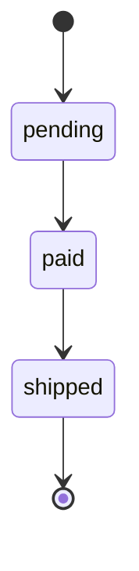
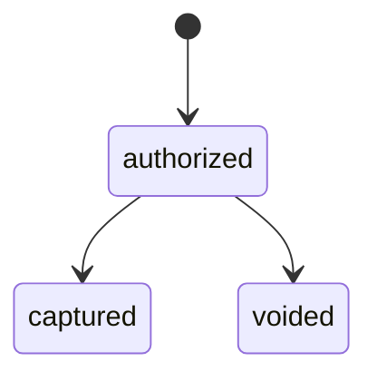
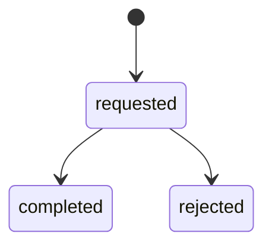

## Order

```mermaid
stateDiagram-v2
  [*] --> pending
  pending --> paid
  paid --> shipped
  shipped --> [*]
```

## Payment

```mermaid
stateDiagram-v2
  [*] --> authorized
  authorized --> captured
  authorized --> voided
```

## Refund

```mermaid
stateDiagram-v2
  [*] --> requested
  requested --> completed
  requested --> rejected
```
